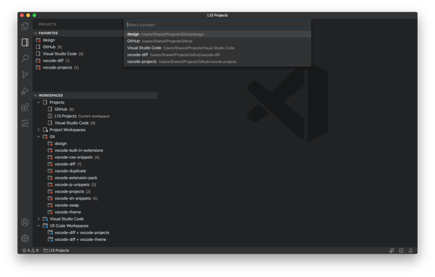
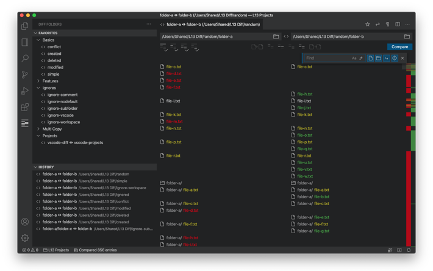
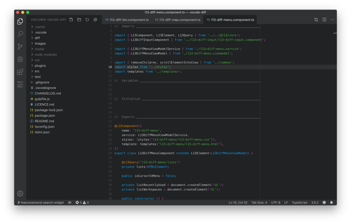

# L13 Extension Pack

This extension pack contains the following extensions.

* [Projects](https://marketplace.visualstudio.com/items?itemName=L13RARY.l13-projects) - Manage your projects, folders and workspaces.
* [Diff Folders](https://marketplace.visualstudio.com/items?itemName=L13RARY.l13-diff) - Compare two folders in Visual Studio Code.
* [Duplicate](https://marketplace.visualstudio.com/items?itemName=L13RARY.l13-duplicate) - Duplicate multiple selections and/or lines.
* [Swap Keywords](https://marketplace.visualstudio.com/items?itemName=L13RARY.l13-swap) - Invert or rotate keywords in JavaScript and TypeScript.
* [Built-In Extensions](https://marketplace.visualstudio.com/items?itemName=L13RARY.l13-built-in-extensions) - Disable built-in extension features in Visual Studio Code.
* [CSS and SCSS Snippets](https://marketplace.visualstudio.com/items?itemName=L13RARY.l13-css-snippets) - Property snippets for CSS and rule snippets for SCSS.
* [JavaScript and TypeScript Snippets](https://marketplace.visualstudio.com/items?itemName=L13RARY.l13-js-snippets) - Keyword snippets and micro patterns for JavaScript and TypeScript.
* [Shell Script Snippets](https://marketplace.visualstudio.com/items?itemName=L13RARY.l13-sh-snippets) - Keyword snippets and micro patterns for shell script.
* [L13 Theme](https://marketplace.visualstudio.com/items?itemName=L13RARY.l13-theme) - Slim dark theme for Visual Studio Code.

## Workspace Extensions

### [Projects](https://marketplace.visualstudio.com/items?itemName=L13RARY.l13-projects)

Manage your projects, folders and workspaces.

### [Diff Folders](https://marketplace.visualstudio.com/items?itemName=L13RARY.l13-diff)

Compare two folders in Visual Studio Code.

### [Built-In Extensions](https://marketplace.visualstudio.com/items?itemName=L13RARY.l13-built-in-extensions)

Disable built-in extension features in Visual Studio Code by cloning the built-in extension into the local extension folder and disable the features you don't need.

## Editor Extensions

### [Duplicate](https://marketplace.visualstudio.com/items?itemName=L13RARY.l13-duplicate)

Duplicate multiple selections and/or lines before or after their current positions.

### [Swap Keywords](https://marketplace.visualstudio.com/items?itemName=L13RARY.l13-swap)

Invert or rotate keywords in JavaScript and TypeScript.

## Snippets

### [CSS and SCSS Snippets](https://marketplace.visualstudio.com/items?itemName=L13RARY.l13-css-snippets)

Contains property snippets for CSS and rule snippets for SCSS.

### [JavaScript and TypeScript Snippets](https://marketplace.visualstudio.com/items?itemName=L13RARY.l13-js-snippets)

Contains keyword snippets and micro patterns for JavaScript and TypeScript.

### [Shell Script Snippets](https://marketplace.visualstudio.com/items?itemName=L13RARY.l13-sh-snippets)

Contains keyword snippets and micro patterns for shell script.

## Theme

### [L13 Theme](https://marketplace.visualstudio.com/items?itemName=L13RARY.l13-theme)

Slim dark theme for Visual Studio Code.

